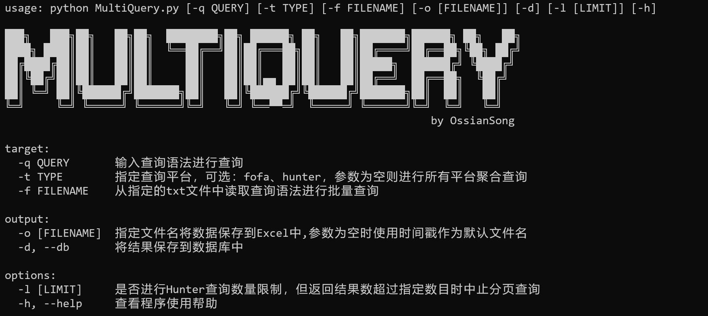

<h1 align="center">MultiQuery</h1>
<p align="center">
    一款多平台黑暗搜索引擎聚合查询工具
</p>
<p align="center">
	
    
    
    
     
</p>
<br>
<br>

## 环境要求

在使用之前需要使用 pip 安装依赖库文件

```python
pip install -r requirements.txt
```

直接运行 python 脚本或使用 `-h` 参数可以查看功能列表



在使用之前，请在配置文件 `config.yaml` 中配置你的 FoFa 和 Hunter 账号

当前脚本仅支持 **FoFa** 和 **Hunter**(奇安信鹰图平台) 聚合查询，后续将会聚合更多搜索引擎

<br>

## 快速使用

### 单一查询

通过参数 `-q` 可以指定查询语法，`-t` 可以指定查询平台，如果未使用 `-t` 参数，将默认使用全部平台进行查询，并会对查询结果进行合并和去重处理

```
python MultiQuery.py -q domain="baidu.com"
```

通过 `-t` 指定查询平台，目前只支持 `fofa` 和  `hunter` 查询，指定查询语法进行 fofa 查询示例如下：

```
python MultiQuery.py -q domain="baidu.com" -t fofa
```

如果需要联合查询多条语句，需要在查询语句最外面使用**双引号**进行闭合：

```
python MultiQuery.py -q "domain="baidu.com"&&title="后台" -t fofa
```

由于hunter存在每日积分限制，可以在配置文件 `config.yaml` 中配置多个账号，这样在一个账号每日积分使用完毕后会自动切换下一个账号进行查询，如下格式修改配置文件

```
account:
    -
      username: 账号1
      key: API-KEY1
    -
      username: 账号2
      key: API-KEY2
    -
      username: 账号3
      key: API-KEY3
```

在进行hunter查询时，部分查询结果返回值过大，可能是同一个IP地址对大量域名进行了解析，返回大量重复无用数据，如果不希望积分全部被一个查询结果耗光，可以通过 `-l` 限制 hunter 最大查询长度，当返回结果超过指定长度便会中止分页查询

```
python MultiQuery.py -q domain="baidu.com" -l 200
```


### 批量查询

在 txt 文件中逐行写入查询语句，如下在 `targets.txt` 中写入查询语句：

```
domain="qq.com"
domain="baidu.com"
title="login"
```

通过 `-f` 可以指定 txt 文件进行批量查询

```
python MultiQuery.py -f targets.txt
```


### 结果保存

查询结果有三种输出方式，分别是列表打印输出、保存到Excel表中、保存到数据库汇总，在不携带输出参数时，将默认进行列表打印输出

如果希望查询结果保存到Excel表中，可以通过参数 `-o` 指定文件名，如果不指定文件名将默认使用当前时间戳作为文件名

```
python MultiQuery.py -q domain="baidu.com" -o 百度
```

如果希望将结果保存到数据库中，需要现在 `config.yaml` 中配置数据库访问信息，再通过 `-d` 指定将数据保存到数据库中

```
python MultiQuery.py -q domain="baidu.com" -d
```


## 后续更新

当前功能尚不完全，后续有时间会聚合更多搜索平台，并进一步提高脚本稳定性，有什么问题和建议可以在issue中提出
